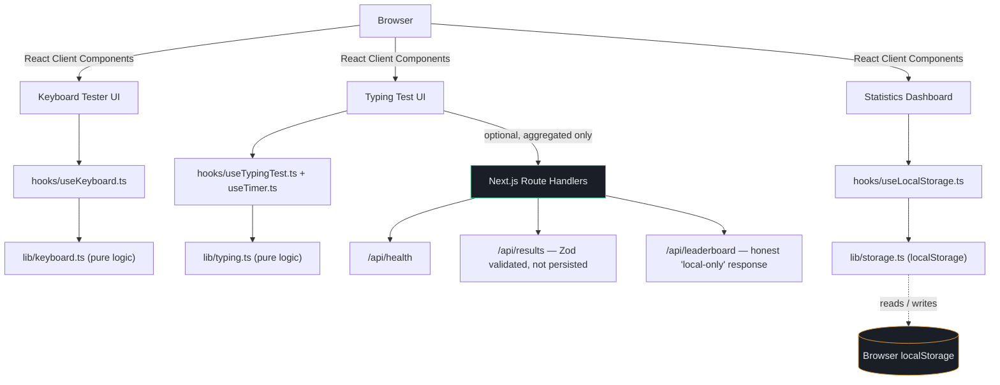

<div align="center">


<br/>

**A professional, full-stack keyboard testing and typing speed measurement web app — built with Next.js, React, and TypeScript.**
Every key press, every WPM calculation, and every diagnostic runs in your browser. No account. No mandatory database.

<br/>

[](https://nextjs.org/)
[](https://react.dev/)
[](https://www.typescriptlang.org/)
[](https://tailwindcss.com/)
[](https://zod.dev/)
[](https://vitest.dev/)
[](./LICENSE)

[](https://keyboardtester-yasir.vercel.app/)

<h3>
  <a href="https://keyboardtester-yasir.vercel.app/">🚀 Live Demo</a>
  <span> · </span>
  <a href="#-features">✨ Features</a>
  <span> · </span>
  <a href="#-installation--setup">⚙️ Setup</a>
  <span> · </span>
  <a href="#-api-endpoints">🔌 API</a>
  <span> · </span>
  <a href="#-about-the-author">👨‍💻 Author</a>
</h3>

</div>

---

## 📋 Table of Contents

<details open>
<summary>Click to expand / collapse</summary>

- [📖 Overview](#-overview)
- [✨ Features](#-features)
- [📸 Preview](#-preview)
- [⌨️ The Keyboard Tester](#-the-keyboard-tester)
- [⏱️ The Typing Speed Test](#-the-typing-speed-test)
- [🧮 WPM & Accuracy Calculation](#-wpm--accuracy-calculation)
- [🔍 Keyboard Diagnostics & Key Detection](#-keyboard-diagnostics--key-detection)
- [💾 Statistics & Data Persistence](#-statistics--data-persistence)
- [📱 Responsive Design & Accessibility](#-responsive-design--accessibility)
- [🎨 Theming](#-theming)
- [🏗️ Architecture](#-architecture)
- [🛠️ Tech Stack](#-tech-stack)
- [📁 Project Structure](#-project-structure)
- [🗺️ Pages & Routes](#-pages--routes)
- [🔌 API Endpoints](#-api-endpoints)
- [⚙️ Installation & Setup](#-installation--setup)
- [💻 Development Commands](#-development-commands)
- [📦 Production Build](#-production-build)
- [☁️ Deployment (Vercel)](#-deployment-vercel)
- [🔐 Environment Variables](#-environment-variables)
- [🧪 Testing](#-testing)
- [🌐 Browser Compatibility & Limitations](#-browser-compatibility--limitations)
- [⌨️ Keyboard Event Handling Details](#-keyboard-event-handling-details)
- [🔒 Security & Privacy](#-security--privacy)
- [⚡ Performance](#-performance)
- [🧭 Architecture & Design Decisions](#-architecture--design-decisions)
- [🚧 Future Improvements](#-future-improvements)
- [🤝 Contributing](#-contributing)
- [📄 License](#-license)
- [👨‍💻 About the Author](#-about-the-author)
- [🏁 Conclusion](#-conclusion)

</details>

---

<h2 id="-overview">📖 Overview</h2>

**Keyboard Tester** is a browser-based diagnostic and performance tool built for anyone who wants to know two things: *"Is every key on my keyboard actually working?"* and *"How fast and accurately do I type?"*

It's built as a genuine full-stack Next.js application — a data-driven virtual keyboard for physical key testing, a timestamp-accurate typing engine for speed and accuracy measurement, and a small set of real (not decorative) API routes — all without requiring a database, a login, or any account creation. Every core feature works the moment the page loads.

This project was deliberately built to avoid the common pitfalls of "AI-generated demo apps": there are no fake buttons, no simulated leaderboard data, and no claims the code doesn't back up. If a feature isn't implemented, it isn't documented here as if it were.

<h2 id="-features">✨ Features</h2>

<table>
<tr>
<td width="50%" valign="top">

### ⌨️ Keyboard Testing
- Full virtual keyboard (function row → numpad)
- **Quick Test** — free-form, live stats
- **Full Keyboard Test** — guided, key-by-key
- **Manual Test** — detailed key inspector
- Honest, non-overclaiming diagnostics

</td>
<td width="50%" valign="top">

### ⏱️ Typing Speed Test
- 15s / 30s / 60s / 120s durations
- Easy / Medium / Hard difficulty
- Words / Sentences / Paragraph modes
- Live WPM, Raw WPM, accuracy, errors
- Full post-test results breakdown

</td>
</tr>
<tr>
<td width="50%" valign="top">

### 💾 Local Statistics
- Best & average WPM / accuracy
- Full test history table
- Lightweight SVG trend chart
- One-click "Clear History"
- Zero setup — no database required

</td>
<td width="50%" valign="top">

### 🎨 Design & Accessibility
- Full dark **and** light themes
- Keycap-inspired design system
- Keyboard-navigable, focus-visible
- `prefers-reduced-motion` support
- Responsive from 320px to 4K

</td>
</tr>
</table>

<h2 id="-preview">📸 Preview</h2>

> This project doesn't yet include committed screenshot assets in the repository, so none are faked here. The fastest way to see it in action is the live deployment:
>
> ### 🔗 **[keyboardtester-yasir.vercel.app](https://keyboardtester-yasir.vercel.app/)**

<h2 id="-the-keyboard-tester">⌨️ The Keyboard Tester</h2>

The keyboard tester renders a complete, data-driven virtual keyboard (`components/keyboard/KeyboardLayout.ts`) covering the function row, number row, QWERTY block, modifier keys, the navigation cluster, arrow keys, and a full numeric keypad — every key defined once as data, not duplicated JSX.

It runs in **three modes**, switchable at any time:

| Mode | What it does |
|---|---|
| **Quick Test** | Press keys freely. Live stats show keys tested, the last key pressed, total key presses, and test duration. |
| **Full Keyboard Test** | A guided sequence prompts you to press one key at a time ("Press the `A` key"), with **Skip** and **mark as not working** options, and a completion summary. |
| **Manual Test** | Press any key and inspect it in detail — its label, `event.code`, category, and press count. |

Every key press updates that key's visual state on the virtual keyboard in real time:

- ⚪ **Untested** — no event received yet
- 🟠 **Currently held** — amber glow, live feedback
- 🟢 **Passed** — a `keydown` event was received for this key
- 🔴 **Attention required** — explicitly marked as not working in Guided mode

A **Diagnostics Summary** panel (`components/keyboard/Diagnostics.tsx`) always shows total/tested/untested/working/problem key counts and test duration — with copy that deliberately avoids overclaiming (see [Limitations](#-browser-compatibility--limitations)).

<h2 id="-the-typing-speed-test">⏱️ The Typing Speed Test</h2>

The typing test (`/typing-test`) is a self-contained engine built around `hooks/useTypingTest.ts` and `hooks/useTimer.ts`. Before starting, you choose:

- **Duration:** 15, 30, 60, or 120 seconds
- **Difficulty:** Easy, Medium, or Hard (changes the actual word/sentence/paragraph content — hard mode includes capitals, numbers, and denser punctuation)
- **Content mode:** Words, Sentences, or Paragraph

Once started, the on-screen text is color-coded character by character (correct / incorrect / current / untyped) with a blinking cursor and smooth auto-scroll, while a live stats bar tracks **WPM**, **Accuracy**, **Time Left**, and **Errors**. Only a small window of characters around the cursor is rendered at any time (not the entire generated passage), which keeps input responsive even during very fast, sustained typing.

On completion (either the timer runs out or the generated passage is exhausted), a full results screen shows Final WPM, Raw WPM, Accuracy, Errors, correct/incorrect/total character counts, duration, and a **performance grade (S / A / B / C / D)** — with options to Try Again, Change Settings, or return to the Keyboard Tester.

<h2 id="-wpm--accuracy-calculation">🧮 WPM & Accuracy Calculation</h2>

All statistics are computed in `lib/typing.ts`, using the standard typing-test convention and real elapsed-time timestamps (never a decrementing counter that can drift):

```ts
// 5 characters = 1 "word" — the industry-standard convention
wpm    = (correctCharacters / 5) / elapsedMinutes
rawWpm = (typedCharacters   / 5) / elapsedMinutes
accuracy  = (correctCharacters / totalTypedCharacters) * 100   // 100% before any input
errorRate = (incorrectCharacters / totalTypedCharacters) * 100
```

- **WPM** counts only correctly typed characters — it rewards precision, not just speed.
- **Raw WPM** counts every keystroke, mistakes included — useful for seeing raw finger speed.
- Every calculation is routed through `safeDivide()` / `roundSafe()` helpers, so a zero-duration or zero-input state can never render `NaN` or `Infinity` in the UI.
- A simple **performance grade** is derived from combined WPM + accuracy thresholds (e.g. `S` requires ≥90 WPM *and* ≥97% accuracy) — high speed with poor accuracy will not earn a top grade.

<h2 id="-keyboard-diagnostics--key-detection">🔍 Keyboard Diagnostics & Key Detection</h2>

Every key press fires a browser `KeyboardEvent` carrying two distinct pieces of information:

| Property | What it represents | Used for |
|---|---|---|
| `event.code` | The **physical key position** (`KeyQ`, `Digit1`, `ShiftLeft`) — independent of layout or language | Identifying *which key* was pressed (the entire job of the keyboard tester) |
| `event.key` | The **character** that key currently produces (`"q"`, `"Q"`, `"!"`) — changes with Shift/Caps Lock/layout | Comparing typed characters against the target text |

The deprecated `event.keyCode` is never used anywhere in this codebase.

**On overclaiming, deliberately avoided:** a browser can only report the events it receives — it cannot prove a key is *physically* broken. So a key that never registers is labeled **"not detected during this test"**, never "this key is broken." This wording appears directly in the Diagnostics panel and the About page.

<h2 id="-statistics--data-persistence">💾 Statistics & Data Persistence</h2>

There is **no database** — local persistence is handled entirely by `lib/storage.ts`, the single module in the codebase that ever touches `window.localStorage`:

- Results are stored under the key `keyboard-tester:history:v1` as versioned JSON, capped at the 200 most recent tests.
- Reads are defensive: server-side rendering, corrupted JSON, an unrelated stored shape, or a full/unavailable storage quota all degrade gracefully to an empty history instead of throwing.
- `hooks/useLocalStorage.ts` is the only React-facing entry point — every component reads and mutates history through this hook, never through `localStorage` directly.
- The Statistics page (`/stats`) surfaces best/average WPM & accuracy, total test count, a lightweight hand-rolled SVG trend chart (no charting library dependency), a sortable results table, and a confirmation-gated **Clear History** action.
- If you've never completed a test, the dashboard shows an honest empty state — never fabricated sample data.

<h2 id="-responsive-design--accessibility">📱 Responsive Design & Accessibility</h2>

- **Responsive:** Verified across mobile, tablet, and desktop breakpoints. The virtual keyboard is naturally wide, so on narrow viewports it scrolls horizontally inside its own container rather than shrinking into illegible keys.
- **Keyboard-operable:** every interactive element (mode tabs, buttons, theme toggle, modals) works from a real keyboard, with a visible, consistent focus ring (`:focus-visible`) throughout.
- **Semantic HTML & ARIA:** dialogs use `role="dialog"` / `aria-modal`, tabs use `role="tablist"` / `aria-selected`, decorative elements are `aria-hidden`.
- **`prefers-reduced-motion`:** globally respected in `app/globals.css` — animation and transition durations collapse to near-zero for users who request reduced motion.
- The virtual keyboard is a *visualization*, not a requirement — every test mode and the typing test itself work correctly from any real keyboard without ever looking at the screen.

<h2 id="-theming">🎨 Theming</h2>

A full dark theme **and** a full light theme are both first-class — not a single color inverted. The signature visual identity is the **"keycap"**: every pressable surface gets a solid bottom shelf shadow that visually compresses on press, and the accent color (amber) is a direct nod to a keyboard's own indicator LEDs.

- Implemented with CSS custom properties (`app/globals.css`) and a `.light` class toggle on `<html>`.
- `components/theme/ThemeProvider.tsx` persists the choice to `localStorage` (`keyboard-tester:theme`) and falls back to the OS's `prefers-color-scheme` on first visit.
- A small inline script runs **before hydration** to apply the correct theme class immediately — there is no flash of the wrong theme on load.

<h2 id="-architecture">🏗️ Architecture</h2>



**Frontend** — Server Components by default for every page; anything touching the keyboard, timers, theme, or `localStorage` is explicitly marked `"use client"`.

**Backend** — Next.js Route Handlers under `app/api/`. There is no separate Express server; **Next.js is the backend.** Each route exists for a genuine, limited purpose rather than to claim "full-stack" without substance (see [API Endpoints](#-api-endpoints)).

**Persistence** — Browser `localStorage` only, behind a single dedicated module. No ORM, no database driver, no external storage service.

<h2 id="-tech-stack">🛠️ Tech Stack</h2>

| Category | Technology | Version |
|---|---|---|
| Framework | [Next.js](https://nextjs.org/) (App Router) | 14.2.15 |
| UI Library | [React](https://react.dev/) | 18.3.1 |
| Language | [TypeScript](https://www.typescriptlang.org/) (strict mode) | 5.6.x |
| Styling | [Tailwind CSS](https://tailwindcss.com/) | 3.4.x |
| Icons | [lucide-react](https://lucide.dev/) | 0.454.x |
| Validation | [Zod](https://zod.dev/) | 3.23.x |
| Fonts | [JetBrains Mono](https://www.jetbrains.com/lp/mono/) + [Inter](https://rsms.me/inter/), self-hosted via `@fontsource` | 5.1.x |
| Testing | [Vitest](https://vitest.dev/) + `jsdom` | 2.1.x |
| Linting | ESLint (`eslint-config-next`) | 8.57.x |
| Deployment | [Vercel](https://vercel.com/) | — |

<h2 id="-project-structure">📁 Project Structure</h2>

<details>
<summary><strong>Click to expand the full directory tree</strong></summary>

```text
keyboard-tester/
├── app/
│   ├── layout.tsx              # Root layout, metadata, theme init script
│   ├── page.tsx                # Home page (hero + keyboard tester + FAQ)
│   ├── globals.css             # Design tokens, dark/light theme, keycap styles
│   ├── icon.svg                # App favicon
│   ├── opengraph-image.tsx     # Dynamically generated OG/Twitter card
│   ├── robots.ts                # robots.txt (metadata route)
│   ├── sitemap.ts               # sitemap.xml (metadata route)
│   ├── error.tsx | loading.tsx | not-found.tsx
│   ├── typing-test/page.tsx
│   ├── stats/page.tsx
│   ├── about/page.tsx
│   ├── privacy/page.tsx
│   └── api/
│       ├── health/route.ts
│       ├── results/route.ts
│       └── leaderboard/route.ts
├── components/
│   ├── keyboard/    # Keyboard, Key, KeyboardRow, KeyboardLayout, KeyboardTester,
│   │                # TestModeSelector, GuidedPrompt, Diagnostics,
│   │                # QuickStatsPanel, KeyInspectorPanel
│   ├── typing/      # TypingTest, TypingText, TypingStats, TypingControls, TypingResults
│   ├── stats/       # StatsCards, TestHistory, PerformanceChart
│   ├── layout/      # Header, Footer, MobileMenu
│   ├── theme/       # ThemeProvider, ThemeToggle
│   └── ui/          # Button, Card, Badge, Modal
├── hooks/
│   ├── useKeyboard.ts       # Physical key detection + test-mode state
│   ├── useTypingTest.ts     # Typing engine: config, stats, completion
│   ├── useTimer.ts          # Timestamp-based countdown (no drift)
│   └── useLocalStorage.ts   # React-facing history + aggregate stats
├── lib/
│   ├── keyboard.ts     # Pure key-state / diagnostics logic
│   ├── typing.ts       # Content generation + WPM/accuracy/grade math
│   ├── storage.ts      # The only module touching window.localStorage
│   ├── validation.ts   # Zod schema for the /api/results payload
│   └── utils.ts        # cn(), safeDivide(), roundSafe(), formatDuration()...
├── types/index.ts       # Shared TypeScript types
├── tests/               # Vitest unit tests (36 tests, 4 files)
├── public/icons/ & public/images/   # Reserved for custom static assets
├── .env.example
├── .eslintrc.json
├── next.config.mjs
├── tailwind.config.ts
├── vitest.config.ts
├── tsconfig.json
├── LICENSE
└── README.md
```

</details>

<h2 id="-pages--routes">🗺️ Pages & Routes</h2>

| Route | Description |
|---|---|
| `/` | Home — hero, live keyboard tester, feature grid, how-it-works, FAQ |
| `/typing-test` | Configurable typing speed test with live stats and results |
| `/stats` | Personal statistics dashboard, sourced entirely from local history |
| `/about` | Explains key detection, WPM/accuracy math, and browser limitations |
| `/privacy` | Plain-language explanation of exactly what is and isn't stored/sent |

<h2 id="-api-endpoints">🔌 API Endpoints</h2>

Every route below is a real Next.js Route Handler with a genuine purpose — none exist merely to claim "full-stack."

<details open>
<summary><strong><code>GET /api/health</code></strong> — service health check</summary>

```json
{
  "success": true,
  "data": {
    "status": "ok",
    "service": "keyboard-tester",
    "timestamp": "2026-09-02T12:00:00.000Z",
    "uptimeSeconds": 42
  }
}
```
</details>

<details>
<summary><strong><code>GET /api/results</code></strong> — reports what the POST endpoint accepts</summary>

```json
{
  "success": true,
  "data": {
    "acceptedDurations": [15, 30, 60, 120],
    "acceptedDifficulties": ["easy", "medium", "hard"],
    "maxPlausibleWpm": 400,
    "note": "This endpoint validates result payloads. It does not store or return past results — there is no server-side database."
  }
}
```
</details>

<details>
<summary><strong><code>POST /api/results</code></strong> — validates an aggregated result payload (Zod)</summary>

Request body:

```json
{
  "wpm": 72,
  "rawWpm": 80,
  "accuracy": 95.5,
  "duration": 30,
  "difficulty": "medium",
  "correctCharacters": 300,
  "incorrectCharacters": 15,
  "errors": 15,
  "timestamp": 1735689600000
}
```

- Rejects malformed JSON with `400`.
- Rejects values outside plausible bounds (e.g. negative counts, WPM > 400, future timestamps) with `422` and a descriptive error.
- On success (`200`), it confirms validation **without persisting anything** — there is no database to persist to. Using this endpoint is entirely optional; the Statistics page never depends on it.
</details>

<details>
<summary><strong><code>GET /api/leaderboard</code></strong> — honest, not faked</summary>

```json
{
  "success": true,
  "data": {
    "mode": "local-only",
    "message": "There is no global leaderboard. This application has no mandatory database, so typing results are kept locally in each user's browser. See the Statistics page for your own local history."
  }
}
```

This project deliberately does **not** return a fabricated global leaderboard.
</details>

<h2 id="-installation--setup">⚙️ Installation & Setup</h2>

```bash
# Clone the repository
git clone <repository-url>
cd keyboard-tester

# Install dependencies
npm install

# Start the development server
npm run dev
```

Then open [http://localhost:3000](http://localhost:3000).

<h2 id="-development-commands">💻 Development Commands</h2>

| Command | Description |
|---|---|
| `npm run dev` | Start the local development server |
| `npm run build` | Create an optimized production build |
| `npm run start` | Serve the production build locally |
| `npm run lint` | Run ESLint across `app/`, `components/`, `hooks/`, `lib/`, `types/` |
| `npm run test` | Run the Vitest suite once |
| `npm run test:watch` | Run Vitest in watch mode |

<h2 id="-production-build">📦 Production Build</h2>

```bash
npm run build
npm run start
```

<h2 id="-deployment-vercel">☁️ Deployment (Vercel)</h2>

This project is live on Vercel:

### 🔗 **[https://keyboardtester-yasir.vercel.app/](https://keyboardtester-yasir.vercel.app/)**

To deploy your own copy:

1. Push this repository to GitHub.
2. Import it at [vercel.com/new](https://vercel.com/new).
3. Vercel auto-detects Next.js — no configuration or environment variables are required.
4. Deploy. Since there's no mandatory database, there is nothing else to provision.

<h2 id="-environment-variables">🔐 Environment Variables</h2>

**None are required.** Every core feature runs client-side or through stateless, database-free API routes. See [`.env.example`](./.env.example) — it's intentionally minimal, reserved only for genuinely future configuration (e.g. an opt-in server-side leaderboard), and does not contain any invented keys.

<h2 id="-testing">🧪 Testing</h2>

```bash
npm run test
```

The suite uses **Vitest** with a `jsdom` environment and currently runs **36 tests across 4 files**, focused entirely on the pure logic layer in `lib/`:

| File | Tests | Covers |
|---|---|---|
| `tests/typing.test.ts` | 10 | Content generation, WPM/Raw WPM math, the 5-chars-per-word standard, accuracy, zero-input safety, grading thresholds |
| `tests/keyboard.test.ts` | 10 | Key-state transitions, immutability, diagnostics counting, guided-sequence filtering |
| `tests/storage.test.ts` | 8 | Saving/retrieving results, corrupted JSON recovery, aggregate stat computation |
| `tests/utils.test.ts` | 8 | `safeDivide`, `roundSafe`, `clamp`, `formatDuration` edge cases |

<h2 id="-browser-compatibility--limitations">🌐 Browser Compatibility & Limitations</h2>

- Keyboard event behavior isn't perfectly uniform across browsers, operating systems, and hardware. `PrintScreen`, `ScrollLock`, `Pause`, and `Meta`/context-menu keys are known to be reported inconsistently, and are excluded from the Guided Test sequence for that reason.
- Touch-only devices cannot physically test a hardware keyboard — the typing test still works with any input method, but the keyboard tester is most meaningful with a real keyboard attached.
- `localStorage` is per-browser, per-device. Clearing site data, switching browsers, or using private/incognito mode will not preserve history.
- There is intentionally **no global leaderboard** — see [API Endpoints](#-api-endpoints).

<h2 id="-keyboard-event-handling-details">⌨️ Keyboard Event Handling Details</h2>

- Physical key identity comes from **`event.code`**, never the deprecated `event.keyCode`.
- `event.repeat` (auto-repeat while holding a key) is explicitly checked so holding a key doesn't inflate its press count or reprocess an already-passed key.
- `preventDefault()` is called **only** where it's actually needed — for example, blocking page scroll from `Space`/`PageUp`/`PageDown`/arrow keys while testing, but only when focus isn't already on an interactive form control. Normal browser navigation (Tab, browser shortcuts, etc.) is left alone everywhere else.
- The typing test intercepts printable characters and `Backspace` on a fully controlled, visually hidden input, rather than trusting an editable field's native value — keeping position-by-position comparison exact.

<h2 id="-security--privacy">🔒 Security & Privacy</h2>

- **No raw keystrokes ever leave the browser.** Keyboard testing and typing calculations are 100% client-side.
- **`POST /api/results` never receives typed text** — only aggregated numbers (WPM, accuracy, counts), and even those are validated and discarded, never stored.
- All API input is validated with **Zod** (`lib/validation.ts`) — malformed JSON and out-of-range values are rejected before any further processing.
- No `dangerouslySetInnerHTML` is used for any user-generated or remote content — the one inline `<script>` in the root layout is a fixed, developer-authored snippet (theme flash prevention) with no user input in it.
- No secrets, API keys, or database credentials exist anywhere in this codebase — there's nothing to leak.
- Full detail is documented in-app on the [`/privacy`](https://keyboardtester-yasir.vercel.app/privacy) page.

<h2 id="-performance">⚡ Performance</h2>

Measured from an actual production build (`npm run build`):

| Route | Page Size | First Load JS |
|---|---|---|
| `/` | 7.61 kB | 102 kB |
| `/typing-test` | 8.81 kB | 103 kB |
| `/stats` | 4.64 kB | 98.6 kB |
| `/about`, `/privacy` | 150 B | 87.3 kB |
| Shared JS (all routes) | — | 87.1 kB |

Other performance choices worth calling out:

- The typing test renders only a **small character window around the cursor**, not the entire generated passage, keeping DOM size — and re-render cost — constant regardless of test length.
- The countdown timer is driven by `Date.now()` timestamps via `requestAnimationFrame`, not a `setInterval` counter, so it can't drift even under tab throttling.
- The trend chart on the Statistics page is a **hand-rolled inline SVG** — no charting library dependency for a handful of points.
- Fonts are self-hosted via `@fontsource` rather than fetched from an external Google Fonts CDN at request time.

<h2 id="-architecture--design-decisions">🧭 Architecture & Design Decisions</h2>

- **Next.js as the entire backend.** A custom Express server was deliberately avoided — Route Handlers are sufficient, simpler, and deploy as a single Vercel project.
- **No database, by design, not by omission.** Every "backend" concern that could reasonably run client-side (history, stats, theme) does — reducing both attack surface and operational cost to zero.
- **Data-driven keyboard layout.** The entire keyboard is described as data (`KeyboardLayoutDefinition`), not hand-written JSX per key, so adding AZERTY, QWERTZ, or a compact layout later is a data change, not a rewrite.
- **Honesty over polish.** Where the app can't know something for certain (a "broken" key, a global rank), the copy says so explicitly instead of rounding up to a more impressive-sounding claim.

<h2 id="-future-improvements">🚧 Future Improvements</h2>

> Realistic ideas — **none of the following are implemented today.**

- [ ] Additional keyboard layouts (AZERTY, QWERTZ, 60%/TKL layouts)
- [ ] Optional user accounts with cloud sync across devices
- [ ] A real, opt-in **global leaderboard** backed by serverless-compatible storage
- [ ] Deeper analytics — per-finger heatmaps, most-mistyped character pairs
- [ ] Multiplayer typing competitions
- [ ] Installable PWA support for offline use

<h2 id="-contributing">🤝 Contributing</h2>

Contributions, issues, and feature suggestions are welcome.

1. Fork the repository
2. Create a feature branch — `git checkout -b feature/your-feature`
3. Commit your changes — `git commit -m "Add: your feature"`
4. Push to your branch — `git push origin feature/your-feature`
5. Open a Pull Request

Before opening a PR, please make sure `npm run lint`, `npm run build`, and `npm run test` all pass.

<h2 id="-license">📄 License</h2>

This project is licensed under the **MIT License** — see [`LICENSE`](./LICENSE) for the full text. You're free to use, modify, and distribute it, including commercially, with attribution.

---

<h2 id="-about-the-author">👨‍💻 About the Author</h2>

<div align="center">


<br/>

**Muhammad Yasir** is a **Full Stack Web Developer, Data Analyst, and AI & Automation Enthusiast** passionate about building scalable web applications, data-driven solutions, and modern software products with clean architecture and outstanding user experience. Currently expanding into **Android App Development**.

<br/>

### 🌐 Connect With Me

[](https://github.com/YasirAwan4831)
[](https://www.linkedin.com/in/yasirawan4831)
[](https://yasirawaninfo.vercel.app)
[](mailto:my3154831409@gmail.com)

<br/>


</div>

---

## ⭐ Support This Project

<div align="center">

If **Keyboard Tester** helped you, taught you something about building typing tools, or you'd simply like to see more projects like it — please consider giving the repository a **Star**. It genuinely helps.

<br/>

[](https://github.com/YasirAwan4831)

<br/>

</div>

---

<h2 id="-conclusion">🏁 Conclusion</h2>

**Keyboard Tester** is built to be exactly what it claims to be: a fast, honest, privacy-respecting tool for testing your keyboard and measuring your typing performance — with real engineering behind every number it shows you. No fabricated data, no unnecessary infrastructure, no login wall between you and the features.

Try it live, read the code, or fork it and make it your own.

<p align="center">
  Crafted with precision and passion by
  <strong><a href="https://yasirawaninfo.vercel.app/" target="_blank">Muhammad Yasir</a></strong><br/>
  Full Stack Web Developer • Data Analyst • AI & Automation Enthusiast • Android Developer
</p>

